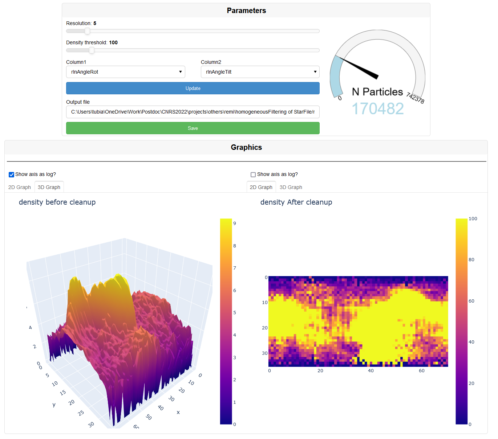

[](https://zenodo.org/badge/latestdoi/575487916)

# RSPFilter
Homogeneous filtering of Relion Star Particles File based on two 

# Installation
For now, only PIP is availble. Install RSPFilter with the command
`pip install RSPFilter`

# Dependancies
- python>=3.8
- numpy
- pandas
- plotly
- scipy
- starfile
- panel


# Usage 
RSPFilter create a WebApplication for interactive filtering and visualization.  
However it can still be used in batch mode with the argument `-g N`

```
usage: RSPFilter.py [-h] [-f FILE] [-r RESOLUTION] [-d THRESHOLD] [-o OUTPUT] [-g GUI]

Homogeneous particle filtering of STAR file

options:
  -h, --help            show this help message and exit
  -f FILE, --file FILE  StarFile
  -r RESOLUTION, --resolution RESOLUTION
                        Grid density (default:5)
  -d THRESHOLD, --threshold THRESHOLD
                        density threshold (default:100)
  -o OUTPUT, --output OUTPUT
                        outputfile
  -g GUI, --gui GUI     start a webserver interactive GUI (Y/n)
  -c1 COLUMN1, --column1 COLUMN1
                        Column 1 in the starfile
  -c2 COLUMN2, --column2 COLUMN2
                        Column 2 in the starfile
```

# Example
## Basic command line
`RSPFilter -f particles.star`

## WebApp Example
In the (simple) WebApp, you can tune the resolution and density threshold per grid square, and save the output file.  

Per default, the outputfile name is the name of the starfile + `_filtered` and the output directory is the same as the input starfile.

You can select which column to be ploted and filtered.

The gauge allow you to observe the reduction of the particle.

You have the density grid before cleanup, and the density grid After cleanup.  
Moreover, you can choose to display 1 or both graphs in 3D surface, with or without a logarithmic scale (sometime it is better when you have big differences)


# Contact
Please open a github issue if you have any issue.


